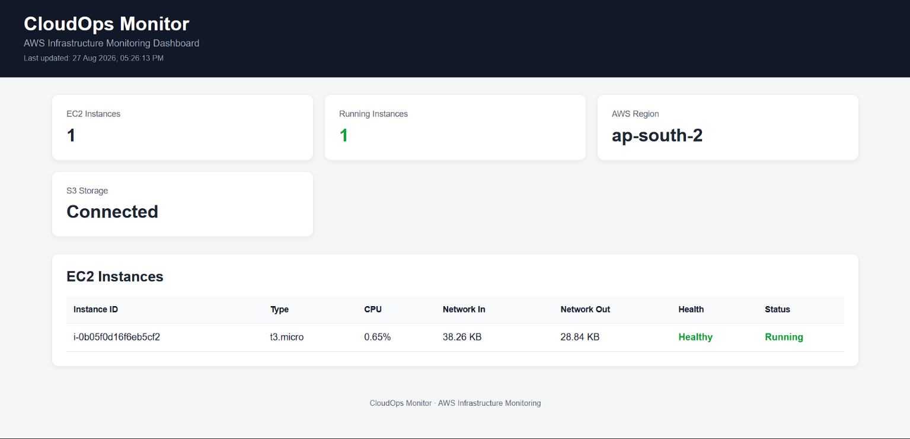

# CloudOps Monitor

AWS infrastructure monitoring dashboard built with Python, Flask, Boto3, and Amazon CloudWatch.

## Project Overview

CloudOps Monitor is a web-based monitoring application that provides visibility into AWS EC2 infrastructure through a centralized dashboard.

The application retrieves EC2 instance information and CloudWatch metrics, processes the data with Python, and displays the results through a Flask web interface.

## Dashboard Preview


The dashboard provides a centralized view of EC2 instances, CPU utilization, network traffic, instance health, and current instance status.

## Features

- Monitor EC2 instance status
- Display running instance count
- Monitor CPU utilization
- Monitor Network In and Network Out
- Display instance health
- CPU-based warning and critical alerts
- Automatic dashboard refresh every 60 seconds
- Last updated timestamp
- CloudWatch error handling
- Persistent deployment using Gunicorn and systemd
- Automatic application restart after EC2 reboot

## Architecture

```text
User Browser
     |
     v
EC2 Public IP :5000
     |
     v
Gunicorn
     |
     v
Flask Application
     |
     +------------------+
     |                  |
     v                  v
   Boto3            Dashboard
     |
     v
IAM Role
     |
     +------------------+
     |                  |
     v                  v
   EC2             CloudWatch
                         |
                         v
                CPU / Network Metrics
```
## Technologies

- Python
- Flask
- Boto3
- Amazon EC2
- Amazon CloudWatch
- AWS IAM
- Gunicorn
- systemd
- HTML
- CSS
- Git
- GitHub

## Monitoring

The dashboard currently displays:

- EC2 Instance ID
- Instance Type
- Instance Status
- CPU Utilization
- Network In
- Network Out
- Instance Health

CPU usage is classified as:

| CPU Usage | Status |
|---|---|
| Below 50% | Healthy |
| 50% - 79% | Warning |
| 80% or higher | Critical |

The dashboard refreshes automatically every 60 seconds.

## AWS Authentication

The application uses an IAM role attached to the EC2 instance for AWS authentication.

AWS access keys and secret keys are not stored in the source code.

## Deployment

The application is hosted on an AWS EC2 instance.

Gunicorn is used as the production application server and systemd is used to manage the application.

The systemd service is configured to:

- Start automatically when the EC2 instance starts
- Restart the application if the process stops
- Run the application using the Python virtual environment

The deployment was tested by rebooting the EC2 instance and verifying that the application started automatically.

## Error Handling

The application handles AWS and CloudWatch errors so that unavailable monitoring data does not immediately stop the dashboard.

When a metric is unavailable, the dashboard can display `N/A` instead of treating the missing value as zero.

## Security

- EC2 IAM role is used for AWS authentication
- AWS credentials are not stored in the application
- Private key files are excluded using `.gitignore`
- `.env` files are excluded from Git
- Flask debug mode is disabled for deployment
- EC2 Security Group access is restricted to the configured source IP

## Project Structure

```text
CloudOps-Monitor/
├── app.py
├── services/
│   ├── ec2_service.py
│   └── cloudwatch_service.py
├── templates/
│   └── dashboard.html
├── requirements.txt
├── README.md
└── .gitignore
```
## Future Improvements

- HTTPS using Nginx
- CloudWatch alarms
- Email or SNS notifications
- Historical monitoring charts
- Multiple EC2 instance support
- Docker deployment
- Terraform infrastructure

## Project Status

Core monitoring, alerting, error handling, and AWS deployment functionality is complete.

Final testing and portfolio review are in progress.
